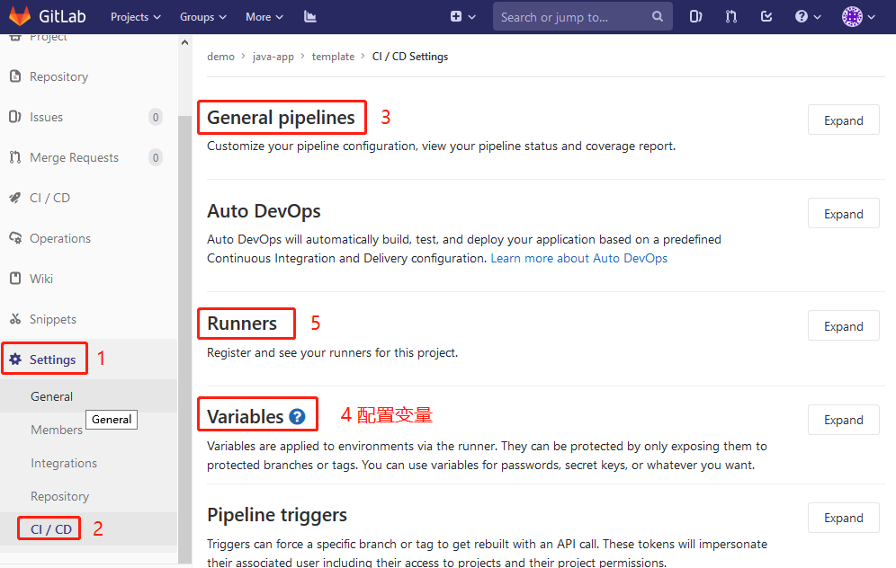
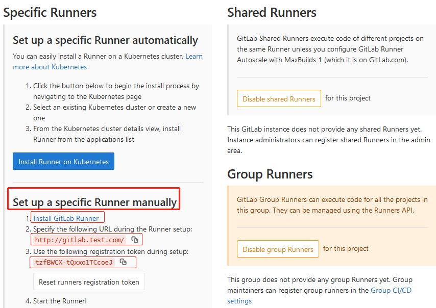
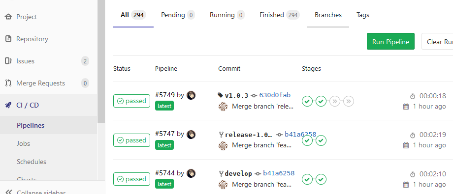

# gitlab CI/CD 基础

gitlab-ci 兼容 travis ci 格式，也是最流行的 CI 工具之一；本文讲解利用 gitlab, gitlab-runner, docker, harbor, kubernetes 等流行开源工具搭建一个自动化CI/CD流水线；举的例子以简单实用为原则，暂时没有选用 dind（docker in dockers）打包、gitlab Auto DevOps 等方式。一个最简单的流水线如下：

- 代码提交 --> 镜像构建 --> 部署测试 --> 部署生产

## 0.前提条件

- 正常运行的 gitlab: [安装 gitlab 文档](gitlab-install.md)
- 正常运行的容器仓库：[安装 Harbor 文档](../harbor.md)
- 正常运行的 k8s 集群：可以是自建/公有云提供商
- 若干虚机运行 gitlab-runner: 运行自动化流水线 pipeline
- 了解代码管理流程 gitflow 等

## 1.准备测试项目代码

假设你要开发一个 spring boot 项目；先登陆你的 gitlab 账号，创建项目，上传你的代码；项目根目录看起来如下：

```
-rw-r--r-- 1 root root    44 Jan  2 16:38 eclipse.bat
drwxr-xr-x 8 root root  4096 Jan  7 15:29 .git/
-rw-r--r-- 1 root root   276 Jan  7 08:44 .gitignore
drwxr-xr-x 3 root root  4096 Jan  7 08:44 example-api/
drwxr-xr-x 3 root root  4096 Jan  7 08:44 example-biz/
drwxr-xr-x 3 root root  4096 Jan  2 16:38 example-dal/
drwxr-xr-x 3 root root  4096 Jan  2 16:38 example-web/
-rw-r--r-- 1 root root    54 Jan  2 16:38 install.bat
-rw-r--r-- 1 root root 10419 Jan  2 16:38 pom.xml
```
传统做法是在本地配置好相关环境后使用 mvn 编译生成jar包，然后测试运行jar；这里我们要把应用打包成 docker 镜像，并创建 CI/CD 流水线：如下示例，在项目根目录新增创建2个文件夹及相关文件

``` bash
dockerfiles        ### 新增文件夹用来 docker 镜像打包
└── Dockerfile     # 定义 docker 镜像
.ci                ### 新增文件夹用来存放 CI/CD 相关内容
├── app.yaml       # k8s 平台的应用部署文件
├── config.sh      # 配置替换脚本
└── gitlab-ci.yml  # gitlab-ci 的主配置文件
```

## 2.准备 docker 镜像描述文件 Dockerfile

我们把 Dockerfile 放在独立目录下，java spring boot 应用可以这样写：

``` bash
cat > dockerfiles/Dockerfile << EOF
FROM openjdk:8-jdk-alpine
VOLUME /tmp
COPY *.jar app.jar         # 这里 *.jar 包就是后续在cicd pipeline 过程中 mvn 生成的jar包移动到此目录
ENTRYPOINT ["java","-Djava.security.egd=file:/dev/./urandom","-jar","/app.jar"]
EOF
```

## 3.准备 CI/CD 相关脚本和文件

装完 gitlab 后使用浏览器登陆gitlab，很容易找到帮助文档，里面有介绍gitlab-ci的内容（文档权威、详细！请多多阅读~ 随着CI/CD流程的深入，部分内容也可以回来查阅），先看如下文档（假设你本地gitlab使用的域名`gitlab.test.com`）

- 文档首页 http://gitlab.test.com/help
- gitlab-ci 基本概念 http://gitlab.test.com/help/ci/README.md
- variables 变量 http://gitlab.test.com/help/ci/variables/README.md

目录`.ci`下面的三个文件`app.yaml`, `config.sh`, `gitlab-ci.yml`是互相关联的；gitlab-ci.yml 文件中会调用到另外两个文件；文件之间又通过一些变量定义联系，流程中用到的变量大致可以分为三种：

- 第一种是gitlab自身预定义变量（比如项目名: CI_PROJECT_NAME，流水线ID: CI_PIPELINE_ID）；无需更改；
- 第二种是在gitlab-ci.yml文件中定义的变量，一般是少量的自定义变量；按需少量改动；
- 第三种是用户可以在项目web界面配置的变量：“Settings”>"CI/CD">"Variables"，本示例项目用到该类型变量举例：

|变量|值|注解|
|:-|:-|:-|
|BETA_APP_REP|1|beta环境应用副本数|
|BETA_DB_HOST|1.1.1.1:3306|beta环境应用连接数据库主机|
|BETA_DB_PWD|xxxx|beta环境数据库连接密码|
|BETA_DB_USR|xxxx|beta环境数据库连接用户|
|BETA_REDIS_HOST|1.1.1.2|beta环境redis主机|
|BETA_REDIS_PORT|6379|beta环境redis端口|
|BETA_REDIS_PWD|xxxx|beta环境redis密码|
|BETA_HARBOR|1.1.1.3|beta环境镜像仓库地址|
|BETA_HARBOR_PWD|xxxx|beta环境镜像仓库密码|
|BETA_HARBOR_USR|xxxx|beta环境镜像仓库用户|
|PROD_APP_REP|2|prod环境应用副本数|
|PROD_DB_HOST|2.2.2.1:3306|prod环境应用连接数据库主机|
|PROD_DB_PWD|xxxx|prod环境数据库连接密码|
|PROD_DB_USR|xxxx|prod环境数据库连接用户|
|PROD_REDIS_HOST|2.2.2.2|prod环境redis主机|
|PROD_REDIS_PORT|6379|prod环境redis端口|
|PROD_REDIS_PWD|xxxx|prod环境redis密码|
|PROD_HARBOR|2.2.2.3|prod环境镜像仓库地址|
|PROD_HARBOR_PWD|xxxx|prod环境镜像仓库密码|
|PROD_HARBOR_USR|xxxx|prod环境镜像仓库用户|
|...|...|根据项目需要自行添加设置|

掌握了以上基础知识，可以开始以下三个任务：

- 3.1[配置 gitlab-ci.yml](gitlab-ci.yml.md), 整个CI/CD的主配置文件，定义所有的CI/CD阶段和每个阶段的任务
- 3.2[配置 config.sh](config.sh.md)，根据不同分支/环境替换不同的应用程序变量（对应上述第三种变量）
- 3.3[配置 app.yaml](app.yaml.md)，K8S应用部署简单模板，替换完成后可以部署到测试/生产的K8S平台上

## 4.为项目配置 CI/CD 及创建 RUNNER

使用浏览器访问gitlab，登陆后，在项目页面进行配置，如图：



- 在 General pipelines 中配置 Custom CI config path 为 .ci/gitlab-ci.yml
- 在 Variables 中配置需要用到的变量
- 在 Runners 中配置注册 gitlab-runner 实例（runner 就是用来自动执行ci job的），点进去后如图：



- 作为入门，先来手动创建 specific Runner，后续同样可以创建 Group Runners/Shared Runners，使用起来更方便；本文档暂不涉及在 kubernetes 自动创建 Runner
  - 按照官网文档安装 Gitlab Runner，参考[文档](gitlab-runner.md)
  - 记下 gitlab URL, 项目 token，注册 Runner 时要用到
  - 在 Gitlab Runner 注册本项目

## 5.提交代码测试 CI/CD Pipelines

终于经过 1~4 步骤把示例项目的CI/CD 流水线创建出来了，是时候试试提交代码测试下成果了；别担心，初次 CI/CD job执行一般都会失败的:) 好在现在你已经基本了解了所有CI/CD流程与配置，失败了就查看错误日志一一排除。另外因为采用虚机安装 Runner 执行 shell 脚本的方式执行 ci job，我们始终可以登陆虚机以手动执行 shell 脚本的方式调试，这对于初学来说很有帮助。查看 CI/CD 执行情况如图：



## 6.gitlab-ci 安全实践

现在为止 CICD Pipelines 已经可以跑通了，甚至稍微修改下 gitlab-ci.yml 配置，项目代码每一次提交后可以自动执行`编译`、`打包`、`部署测试`、`部署生产`等等工作；也许你还没来得及慢慢体会这顺畅的感觉，赶紧先踩个刹车，控制下车速；因为现在你需要考虑 gitlab-ci 的安全配置了，这很重要！

首先 gitlab 项目的基本安全就是项目成员控制，访问项目的权限分为：所有者（Owner），维护者（Maintainer），开发者（Developer），报告者（Reporter），访客（Guest）；详细的权限介绍请查阅官方文档，这里简单地介绍两类权限：所有者和维护者属于`特权用户`，开发者属于`普通用户`，他们应该具有如下权限区分：

- 特权用户对整个项目负责，包括项目代码开发、配置管理、CI流程、测试环境、生产环境等
- 特权用户可以提交代码到所有分支包括 master/release 分支，执行所有 ci job
- 普通用户只负责对应项目模块代码开发、不接触程序配置、只能访问测试环境
- 普通用户只能提交代码到 develop/feature 分支，只能执行这两个分支的 ci job

以下的安全实践配置作为个人经验分享，仅作参考；如果你的项目需要更高的安全性，请阅读 gitlab-ci 官方相关文档，尝试找到属于自己的最佳实践。

- 正确设置项目成员（Settings >> Members），严格限制项目维护者（Maintainer）人数，大部分应该作为开发者（Developer）提交代码
- 配置项目受保护分支/受保护tag http://gitlab.test.com/help/user/project/protected_branches.md，一般把master/release分支设置成受保护分支，限制只有维护者才能在保护分支commit和merge，从而限制只有维护者才能执行部署生产的 ci job
- 配置受保护的变量 http://gitlab.test.com/help/ci/variables/README#protected-variables 受保护的变量只在受保护分支和受保护tag的pipeline中可见，防止生产环境配置参数泄露
- 配置受保护的Runner，只能执行受保护分支上的 ci jobs
- CICD Pipelines 中发布生产的任务请设置手动执行，同样生产的回退设置手动执行

